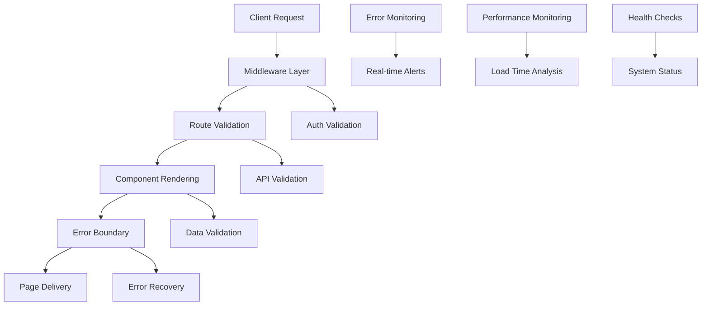
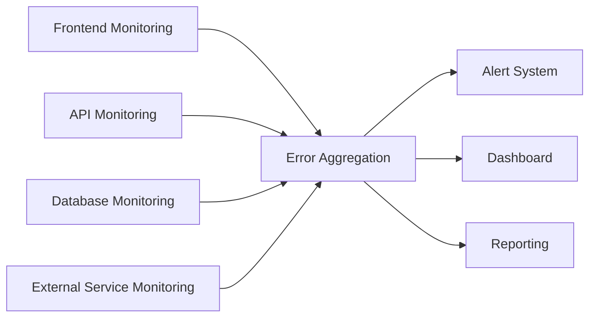
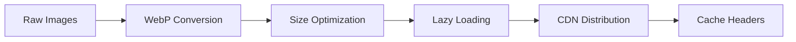
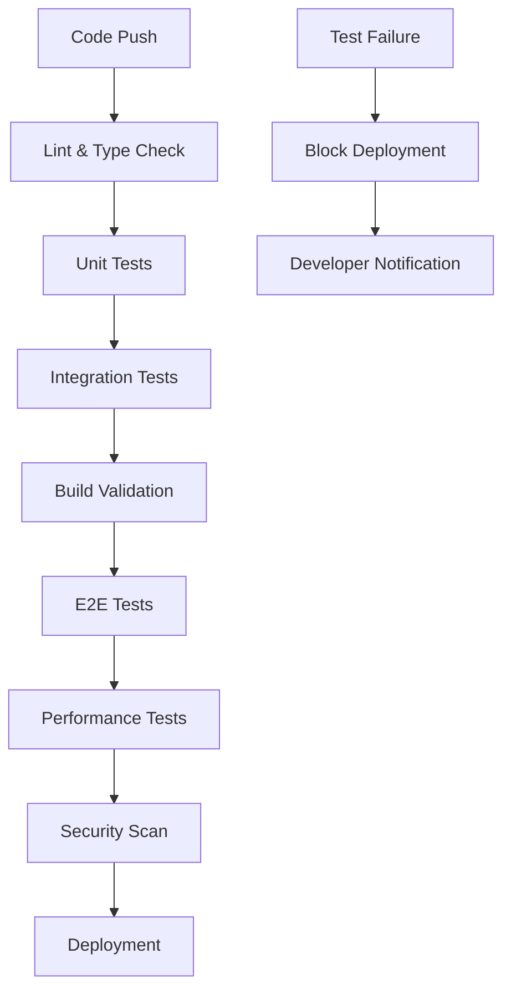

# Website Error-Free Operation & Page Loading Validation Technical Specification

## 1. Overview

This specification defines a comprehensive approach to ensure the fibre-elite-glow website operates completely error-free with reliable page loading across all routes and user scenarios. The system implements multi-layered validation, monitoring, and automated testing to achieve 99.9% uptime and zero critical errors in production.

**Primary Objectives:**
- Eliminate all runtime errors and exceptions
- Ensure 100% of pages load correctly under normal and stress conditions
- Implement comprehensive error detection and recovery mechanisms
- Establish continuous monitoring and alerting systems
- Provide automated testing coverage for all user journeys

## 2. Architecture

### Error Detection & Prevention Framework



### Monitoring Architecture



## 3. Error Detection & Prevention System

### Runtime Error Prevention

| Component | Validation Strategy | Error Handling |
|-----------|-------------------|----------------|
| **Page Routes** | Route existence validation, parameter validation | 404 fallback, error boundaries |
| **API Endpoints** | Schema validation, auth checks | Structured error responses |
| **Component Rendering** | Prop validation, state management | Error boundaries, fallback UI |
| **Data Fetching** | Network error handling, timeout management | Retry logic, offline support |
| **Authentication** | Token validation, session management | Automatic refresh, login redirect |
| **Payment Processing** | Stripe validation, webhook verification | Transaction rollback, user notification |

### Page Loading Validation

#### Core Pages Validation Matrix

| Page Category | Route | Critical Elements | Load Time Target | Error Scenarios |
|---------------|-------|-------------------|------------------|-----------------|
| **Landing** | `/` | Hero, CTA, Navigation | < 2s | Network timeout, API failure |
| **Product Pages** | `/products/*` | Product data, images, pricing | < 3s | Missing product, image load failure |
| **Ingredient Pages** | `/ingredients/*` | Content, metadata, images | < 2s | Missing content, broken links |
| **Authentication** | `/login`, `/signup` | Forms, validation, redirect | < 1.5s | Auth service down, validation errors |
| **E-commerce** | `/cart`, `/checkout` | Product data, Stripe integration | < 2s | Payment service down, cart corruption |
| **Account Management** | `/account/*` | User data, order history | < 2s | Data sync failure, session timeout |
| **Static Pages** | `/about`, `/faq`, `/terms` | Content, navigation | < 1s | Content missing, routing error |

#### Dynamic Route Validation

```typescript
interface RouteValidation {
  path: string;
  params?: Record<string, string>;
  expectedElements: string[];
  loadTimeTarget: number;
  fallbackStrategy: string;
}

const routeValidations: RouteValidation[] = [
  {
    path: "/products/[slug]",
    params: { slug: "total-essential" },
    expectedElements: ["product-title", "price", "add-to-cart"],
    loadTimeTarget: 3000,
    fallbackStrategy: "product-not-found-page"
  },
  {
    path: "/ingredients/[slug]",
    params: { slug: "acai-berry" },
    expectedElements: ["ingredient-title", "benefits", "image"],
    loadTimeTarget: 2000,
    fallbackStrategy: "ingredient-not-found-page"
  }
];
```

## 4. Testing Strategy

### Automated Testing Framework

#### Unit Testing Coverage
- **Component Testing**: All React components with prop validation
- **Hook Testing**: Custom hooks with edge cases
- **Utility Testing**: Helper functions and utilities
- **API Testing**: All API endpoints with error scenarios

#### Integration Testing
- **Page Integration**: Full page rendering with real data
- **Authentication Flow**: Complete login/logout cycles
- **E-commerce Flow**: Cart to checkout completion
- **API Integration**: Frontend to backend communication

#### End-to-End Testing Matrix

| Test Suite | Coverage | Frequency | Browser Support |
|------------|----------|-----------|-----------------|
| **Critical Path** | Authentication, Checkout, Product Browse | Every deployment | Chrome, Firefox, Safari |
| **Page Loading** | All routes, error pages, redirects | Daily | Chrome, Firefox, Safari, Mobile |
| **Performance** | Core Web Vitals, load times | Weekly | Chrome (Lighthouse) |
| **Cross-browser** | Full functionality | Weekly | Chrome, Firefox, Safari, Edge |
| **Mobile Responsive** | Touch interactions, viewport | Daily | Mobile Chrome, Safari |
| **Accessibility** | WCAG compliance, screen readers | Weekly | Chrome (axe-core) |

#### Error Scenario Testing

```typescript
interface ErrorScenarioTest {
  scenario: string;
  trigger: string;
  expectedBehavior: string;
  recoveryMechanism: string;
}

const errorScenarios: ErrorScenarioTest[] = [
  {
    scenario: "API Service Down",
    trigger: "Network failure during page load",
    expectedBehavior: "Graceful fallback with retry option",
    recoveryMechanism: "Cached data display + retry button"
  },
  {
    scenario: "Payment Processing Error",
    trigger: "Stripe service interruption",
    expectedBehavior: "Clear error message + retry option",
    recoveryMechanism: "Transaction rollback + user notification"
  },
  {
    scenario: "Authentication Token Expired",
    trigger: "Session timeout during navigation",
    expectedBehavior: "Seamless token refresh or login redirect",
    recoveryMechanism: "Automatic refresh with fallback to login"
  }
];
```

## 5. Performance Monitoring & Optimization

### Real-time Performance Metrics

| Metric | Target | Alert Threshold | Measurement |
|--------|--------|-----------------|-------------|
| **First Contentful Paint** | < 1.5s | > 2.5s | Lighthouse |
| **Largest Contentful Paint** | < 2.5s | > 4s | Core Web Vitals |
| **Cumulative Layout Shift** | < 0.1 | > 0.25 | Core Web Vitals |
| **Time to Interactive** | < 3s | > 5s | Lighthouse |
| **Page Load Time** | < 3s | > 5s | Custom analytics |
| **API Response Time** | < 500ms | > 2s | Server monitoring |

### Performance Optimization Strategy

#### Image Optimization Pipeline


#### Code Splitting Strategy
- **Route-based splitting**: Each page bundle < 250KB
- **Component-based splitting**: Large components lazy-loaded
- **Vendor splitting**: Third-party libraries separate bundle
- **Critical CSS**: Above-fold styles inlined

## 6. Error Monitoring & Alerting

### Error Classification System

| Error Level | Examples | Response Time | Escalation |
|-------------|----------|---------------|------------|
| **Critical** | Payment failures, data corruption | < 5 min | Immediate developer notification |
| **High** | Page load failures, API errors | < 15 min | Team notification |
| **Medium** | UI glitches, slow responses | < 1 hour | Log aggregation |
| **Low** | Console warnings, minor bugs | < 24 hours | Weekly review |

### Monitoring Implementation

#### Frontend Error Tracking
```typescript
interface ErrorReport {
  type: 'javascript' | 'network' | 'performance';
  message: string;
  stack: string;
  url: string;
  userAgent: string;
  timestamp: number;
  userId?: string;
  severity: 'low' | 'medium' | 'high' | 'critical';
}

class ErrorMonitor {
  static reportError(error: Error, context: string) {
    const report: ErrorReport = {
      type: 'javascript',
      message: error.message,
      stack: error.stack || '',
      url: window.location.href,
      userAgent: navigator.userAgent,
      timestamp: Date.now(),
      severity: this.classifyError(error, context)
    };
    
    this.sendToMonitoring(report);
  }
}
```

#### Health Check Endpoints
- **System Health**: `/api/health` - Database, cache, external services
- **Database Health**: `/api/health/database` - Connection, query performance
- **Payment Health**: `/api/health/stripe` - Stripe API connectivity
- **Authentication Health**: `/api/health/auth` - Supabase connectivity

## 7. Automated Quality Assurance

### Pre-deployment Validation Pipeline



### Continuous Monitoring Pipeline

#### Daily Automated Checks
- **Page Accessibility**: All routes WCAG 2.1 AA compliance
- **Performance Regression**: Core Web Vitals tracking
- **Broken Link Detection**: Internal and external link validation
- **Image Optimization**: Large image detection and optimization suggestions
- **Security Scanning**: Dependency vulnerability checks

#### Weekly Comprehensive Audits
- **Cross-browser Compatibility**: Full functionality across supported browsers
- **Mobile Responsiveness**: Touch interaction and viewport testing
- **SEO Compliance**: Meta tags, structured data, sitemap validation
- **Performance Benchmarking**: Comparison with previous weeks

## 8. Error Recovery & Fallback Mechanisms

### Client-side Error Recovery

#### Component Error Boundaries
```typescript
class PageErrorBoundary extends Component {
  state = { hasError: false, errorInfo: null };
  
  static getDerivedStateFromError(error: Error) {
    return { hasError: true };
  }
  
  componentDidCatch(error: Error, errorInfo: ErrorInfo) {
    ErrorMonitor.reportError(error, 'page-boundary');
    this.setState({ errorInfo });
  }
  
  render() {
    if (this.state.hasError) {
      return <ErrorFallbackComponent 
        onRetry={() => this.setState({ hasError: false })}
        errorType="page-render"
      />;
    }
    return this.props.children;
  }
}
```

#### Network Error Recovery
```typescript
class NetworkErrorRecovery {
  static async fetchWithRetry(url: string, options: RequestInit, maxRetries = 3) {
    for (let attempt = 1; attempt <= maxRetries; attempt++) {
      try {
        const response = await fetch(url, options);
        if (!response.ok) throw new Error(`HTTP ${response.status}`);
        return response;
      } catch (error) {
        if (attempt === maxRetries) {
          ErrorMonitor.reportError(error as Error, `network-retry-${attempt}`);
          throw error;
        }
        await this.delay(Math.pow(2, attempt) * 1000); // Exponential backoff
      }
    }
  }
}
```

### Server-side Error Handling

#### API Error Responses
```typescript
interface APIErrorResponse {
  success: false;
  error: {
    code: string;
    message: string;
    details?: Record<string, any>;
    retryable: boolean;
  };
  timestamp: string;
  requestId: string;
}

class APIErrorHandler {
  static handleError(error: Error, req: Request): APIErrorResponse {
    const errorCode = this.classifyError(error);
    const isRetryable = this.isRetryableError(error);
    
    return {
      success: false,
      error: {
        code: errorCode,
        message: this.getUserFriendlyMessage(errorCode),
        retryable: isRetryable
      },
      timestamp: new Date().toISOString(),
      requestId: req.headers['x-request-id'] || 'unknown'
    };
  }
}
```

## 9. Implementation Roadmap

### Phase 1: Foundation (Week 1-2)
- [ ] Implement comprehensive error boundaries
- [ ] Set up performance monitoring
- [ ] Create health check endpoints
- [ ] Establish error classification system

### Phase 2: Testing Infrastructure (Week 3-4)
- [ ] Expand E2E test coverage to all routes
- [ ] Implement automated accessibility testing
- [ ] Set up cross-browser testing pipeline
- [ ] Create performance regression testing

### Phase 3: Monitoring & Alerting (Week 5-6)
- [ ] Deploy real-time error monitoring
- [ ] Configure automated alerts
- [ ] Implement performance dashboards
- [ ] Set up automated quality gates

### Phase 4: Optimization & Recovery (Week 7-8)
- [ ] Implement intelligent error recovery
- [ ] Optimize critical performance paths
- [ ] Deploy advanced monitoring features
- [ ] Create automated remediation workflows

## 10. Success Metrics & KPIs

### Reliability Metrics
- **Uptime**: > 99.9%
- **Error Rate**: < 0.1% of all requests
- **Page Load Success Rate**: > 99.5%
- **Critical Error Resolution Time**: < 5 minutes

### Performance Metrics
- **Average Page Load Time**: < 2 seconds
- **Core Web Vitals Compliance**: > 95% of pages
- **Mobile Performance Score**: > 90 (Lighthouse)
- **Accessibility Compliance**: 100% WCAG 2.1 AA

### User Experience Metrics
- **Bounce Rate**: < 30%
- **Page Completion Rate**: > 95%
- **Checkout Success Rate**: > 98%
- **User-reported Issues**: < 1 per 1000 users

### Testing Coverage Metrics
- **Code Coverage**: > 85%
- **Route Coverage**: 100% of public routes
- **Browser Coverage**: Chrome, Firefox, Safari, Edge
- **Device Coverage**: Desktop, tablet, mobile